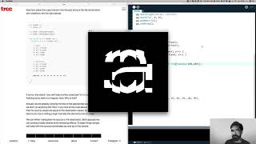
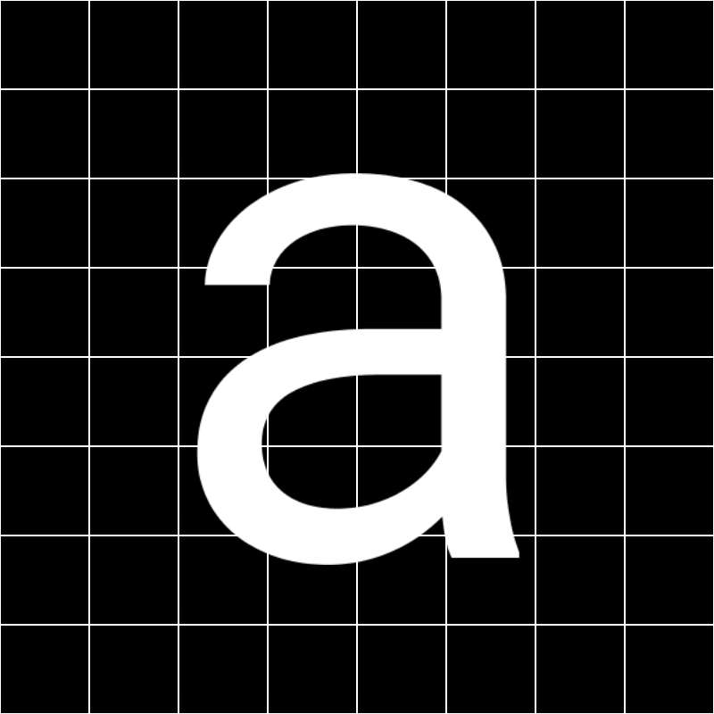
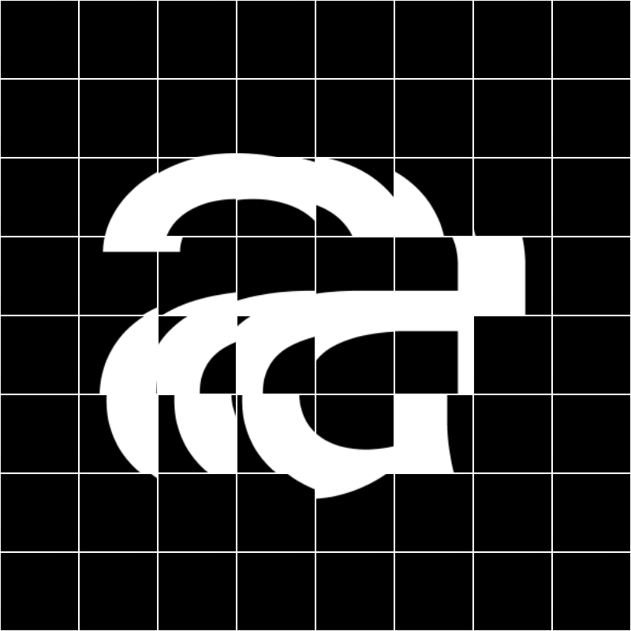
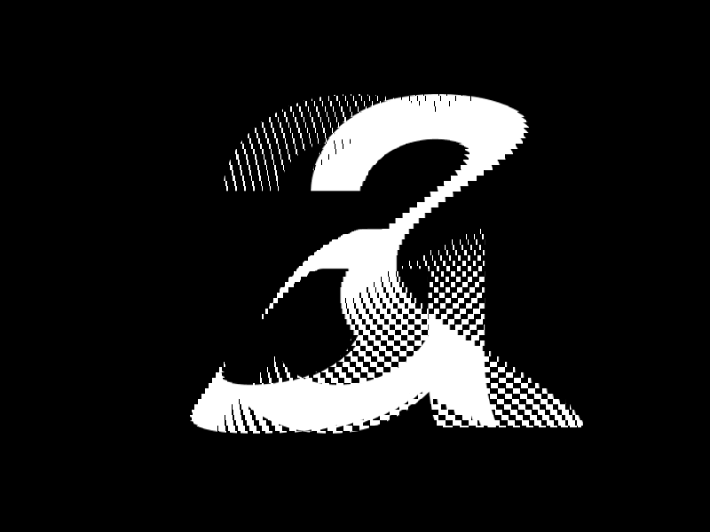
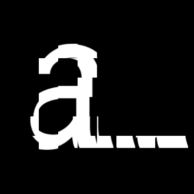
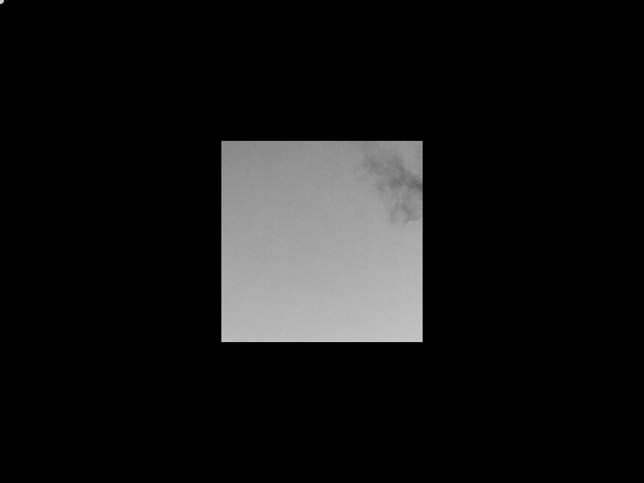

# Processing-Tutorial: Kinetic Typography 1

[](https://youtu.be/SKDhkB8g1So)

ここ数年，私( [Tim Rodenbröker](https://timrodenbroeker.de/about/) さん)はタイポグラフィとグラフィックデザインにおける新しい傾向を観察してきた．それは，Adobe After Effectsのような手頃なアニメーションソフトウェア，可変フォント，Creative Codingにおけるよりアクセスしやすいツールの台頭によって可能となったものである．キネティック・タイポグラフィは，動く柔軟なタイポグラフィ・システムの総称であり，この分野の新入りである．

いくつか良い例です．[DIAスタジオ](https://dia.tv/) の全作品， [Zach Lieberman](https://www.instagram.com/zach.lieberman/?hl=de) によるめちゃくちゃクールなARアプリ「 [Weired Type](https://apps.apple.com/de/app/weird-type/id1352785248) 」です．

このチュートリアルでは，活字をアニメーション化するための派手なアプローチをお見せしたいと思います．このアプリケーションでは，シンプルなレタリングを長方形の断片に分割し，それぞれの断片を水平軸上で少しずつずらします．そのために，2次元のグリッドを利用し，そこに正弦波を入れます．準備はいいですか？さあ，始めましょう．








[Download this tutorial with all assets on Github](https://github.com/timrodenbroeker/tutorials)

## The copy()-function

定義された領域のピクセルを別の領域にコピーしたい場合，コピー関数は適切なツールです．その最も単純な形は，8つの引数を取る．最初の4つの整数値は，コピーしたい領域を定義します．最後の4つはコピー先を定義する．このチュートリアルでは，わかりやすくするために，変数を使用することにします．

```Processing
// SOURCE
int sx = 0;
int sy = 0;
int sw = 100;
int sh = 100;

// DESTINATION
int dx = 100;
int dy = 100;
int dw = 200;
int dh = 200;

copy(sx, sy, sw, sh, dx, dy, dw, dh);
```

最良の結果を得て，視覚的なフィードバックを防ぐために，ピクセルをコピーしたいテンプレートを定義する別のパラメータをそこに置くことができます．つまり，スケッチから直接ピクセルを取得する代わりに，画像やPGraphicsオブジェクトのような別の表面を参照として使用し，それをコピー関数の最初の場所に追加の引数として渡すことができるのです．



上の例では，PImage-surfaceのエリアをスケッチ・ウィンドウにコピーしています．マウスの位置は，ソースの座標をコントロールします．

```Processing
// SOURCE
int sx = mouseX + 150;
int sy = mouseY + 150;
int sw = 150;
int sh = 150;

// DESTINATION
int dx = width/2 - 125;
int dy = height/2 - 125;
int dw = 250;
int dh = 250;

copy(sx, sy, sw, sh, dx, dy, dw, dh);
```

今回のキネティックタイプの実験では，これと全く同じことを，2次元のグリッドにある複数の要素で行いたいと思います．では，実際のスケッチをまとめましょう．

## Preparing the sketch

まず，テンプレートとして使用したい [PGraphics](https://processing.org/reference/PGraphics.html) オブジェクトを作成し，初期化する必要があります．次に， [PFont](https://processing.org/reference/PFont.html) を作成し，初期化します．注意：フォントファイルをデータフォルダにコピーしていることを確認してください．今回使うフォントは，[RobotoMono](https://fonts.google.com/specimen/Roboto+Mono) です．

```Processing
PGraphics pg;
PFont font;

void setup() {
    font = createFont("RobotMono-Regular.ttf", 600);
    size(800, 800, P2D);
    pg = createGraphics(800, 800, P2D);
}
```

次に，レンダリングをdraw関数ないのPGraphics要素に配置し，中央に配置します．

PGraphicsを使ったことがない方のために説明しますと，PGraphicsはPhotoshopのレイヤーと同様のものです．PGraphicsは，Photoshopのレイヤーと同様なので，実際のスケッチでは，独立したスケッチとして扱うことができます．これは，複雑さを管理し，物事を切り取るための非常に強力なツールです．いつものように，もし，ここで行き詰ったら， [リファレンス](https://processing.org/reference/PGraphics.html) を調べてみてください．

```Processing
void draw() {
  background(0);
  pg.beginDraw();
  pg.background(0);
  pg.fill(255);
  pg.textFont(font);
  pg.textSize(800);
  pg.pushMatrix();
  pg.translate(width/2, height/2-215);
  pg.textAlign(CENTER, CENTER);
  pg.text("a", 0, 0);
  pg.popMatrix();
  pg.endDraw();
}
```

実行ボタンを押しても何も表示されませんが，これはPGraphicsを描画していないからです．それでは，image関数を使って手っ取り早く，すべてが正しい場所に配置されているかどうかをチェックしてみましょう．

```Processing
image(pg, 0, 0);
```


