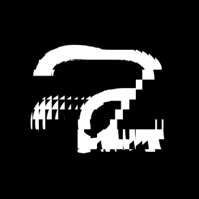

# Processing-Tutorial: Kinetic Typography 1

[](https://youtu.be/SKDhkB8g1So)

ここ数年，私( [Tim Rodenbröker](https://timrodenbroeker.de/about/) さん)はタイポグラフィとグラフィックデザインにおける新しい傾向を観察してきた．それは，Adobe After Effectsのような手頃なアニメーションソフトウェア，可変フォント，Creative Codingにおけるよりアクセスしやすいツールの台頭によって可能となったものである．キネティック・タイポグラフィは，動く柔軟なタイポグラフィ・システムの総称であり，この分野の新入りである．

いくつか良い例です．[DIAスタジオ](https://dia.tv/) の全作品， [Zach Lieberman](https://www.instagram.com/zach.lieberman/?hl=de) によるめちゃくちゃクールなARアプリ「 [Weired Type](https://apps.apple.com/de/app/weird-type/id1352785248) 」です．

このチュートリアルでは，活字をアニメーション化するための派手なアプローチをお見せしたいと思います．このアプリケーションでは，シンプルなレタリングを長方形の断片に分割し，それぞれの断片を水平軸上で少しずつずらします．そのために，2次元のグリッドを利用し，そこに正弦波を入れます．準備はいいですか？さあ，始めましょう．




[Download this tutorial with all assets on Github](https://github.com/timrodenbroeker/tutorials)

## The copy()-function

定義された領域のピクセルを別の領域にコピーしたい場合，コピー関数は適切なツールです．その最も単純な形は，8つの引数を取る．最初の4つの整数値は，コピーしたい領域を定義します．最後の4つはコピー先を定義する．このチュートリアルでは，わかりやすくするために，変数を使用することにします．

```Processing
// SOURCE
int sx = 0;
int sy = 0;
int sw = 100;
int sh = 100;

// DESTINATION
int dx = 100;
int dy = 100;
int dw = 200;
int dh = 200;

copy(sx, sy, sw, sh, dx, dy, dw, dh);
```

最良の結果を得て，視覚的なフィードバックを防ぐために，ピクセルをコピーしたいテンプレートを定義する別のパラメータをそこに置くことができます．つまり，スケッチから直接ピクセルを取得する代わりに，画像やPGraphicsオブジェクトのような別の表面を参照として使用し，それをコピー関数の最初の場所に追加の引数として渡すことができるのです．


上の例では，PImage-surfaceのエリアをスケッチ・ウィンドウにコピーしています．マウスの位置は，ソースの座標をコントロールします．

```Processing
// SOURCE
int sx = mouseX + 150;
int sy = mouseY + 150;
int sw = 150;
int sh = 150;

// DESTINATION
int dx = width/2 - 125;
int dy = height/2 - 125;
int dw = 250;
int dh = 250;

copy(sx, sy, sw, sh, dx, dy, dw, dh);
```

今回のキネティックタイプの実験では，これと全く同じことを，2次元のグリッドにある複数の要素で行いたいと思います．では，実際のスケッチをまとめましょう．

## Preparing the sketch

まず，テンプレートとして使用したい [PGraphics](https://processing.org/reference/PGraphics.html) オブジェクトを作成し，初期化する必要があります．次に， [PFont](https://processing.org/reference/PFont.html) を作成し，初期化します．注意：フォントファイルをデータフォルダにコピーしていることを確認してください．今回使うフォントは，[RobotoMono](https://fonts.google.com/specimen/Roboto+Mono) です．

```Processing
PGraphics pg;
PFont font;

void setup() {
    font = createFont("RobotMono-Regular.ttf", 600);
    size(800, 800, P2D);
    pg = createGraphics(800, 800, P2D);
}
```

次に，レンダリングをdraw関数ないのPGraphics要素に配置し，中央に配置します．

PGraphicsを使ったことがない方のために説明しますと，PGraphicsはPhotoshopのレイヤーと同様のものです．PGraphicsは，Photoshopのレイヤーと同様なので，実際のスケッチでは，独立したスケッチとして扱うことができます．これは，複雑さを管理し，物事を切り取るための非常に強力なツールです．いつものように，もし，ここで行き詰ったら， [リファレンス](https://processing.org/reference/PGraphics.html) を調べてみてください．

```Processing
void draw() {
  background(0);
  pg.beginDraw();
  pg.background(0);
  pg.fill(255);
  pg.textFont(font);
  pg.textSize(800);
  pg.pushMatrix();
  pg.translate(width/2, height/2-215);
  pg.textAlign(CENTER, CENTER);
  pg.text("a", 0, 0);
  pg.popMatrix();
  pg.endDraw();
}
```

実行ボタンを押しても何も表示されませんが，これはPGraphicsを描画していないからです．それでは，image関数を使って手っ取り早く，すべてが正しい場所に配置されているかどうかをチェックしてみましょう．

```Processing
image(pg, 0, 0);
```


ここまでは順調です，これからやるべきことは，グリッドを作成するための2次元のforループをラップすることです．しかし，これは，正しい寸法を計算するために使うことができます．まず，X軸とY軸の両方に8枚のタイルを配置することにしましょう．

```Processing
int tilesX = 8;
int tilesY = 8;

int tileW = int(width/tilesX);
int tileY = int(height/tilesY);

for(int y = 0; y < tilesY; y++) {
  for(int x = 0; x < tilesX; x++) {
    ...
  }
}
```


次に，コピー機能をグリッドに配置し，タイルの寸法と位置を適切な場所に配置しましょう．

```Processing
int tilesX = 8;
int tilesY = 8;

int tileW = int(width/tilesX);
int tileH = int(height/tilesY);

for (int y = 0; y < tilesY; y++) {
  for (int x = 0; x < tilesX; x++) {
    
    // SOURCE
    int sx = x*tileW;
    int sy = y*tileH;
    int sw = tileW;
    int sh = tileH;
    
    // DESTINATION
    int dx = x*tileW;
    int dy = y*tileH;
    int dw = tileW;
    int dh = tileH;
      
    copy(pg, sx, sy, sw, sh, dx, dy, dw, dh);
    }
  }
```

今スケッチを実行すると，ウィンドウに白い小文字の "a" が表示されます．ここでは，何も派手なことは起こっていないようです．なぜでしょうか？

実は，すでにタイルを適切な位置にコピーしているのですが，それに対して何もしていないのです．上のコードを見ると，コピー元の値とコピー先の値が等しいことがわかると思います．そこで，これからやるべきことは，要素に移動方法を指示するロジックをかくことです．

移動元を操作することも，移動先を操作することもできる．どちらの方法でも，まったく異なる面白い効果が得られます．このチュートリアルでは，シンプルに，ソース座標（ `sx` と `sy` ）を操作することにします．


## Pushing a wave through the grid

さて，次は歪み効果を表す変数を定義する番です．この変数はネストされたforループの中にあり，各反復でわずかに異なるものであんければならない．もしこの変数の出力があまりに無秩序だと，ランダムな効果を生み出してしまいます．それは，私たちが望んでいるものとはちょっと違います．私たちの目的はスムーズな動きを得ることなので，frameCountとループ内の座標によって制御されるsin()関数を使用することになります．

```Processing
int wave = int(sin(frameCount * 0.01 + (x * y)) * 30);
```

sin()関数をまだ一度も使ったことがなくても，心配はいりません．これは-1から1の間の値を生成し，その位相を制御するために引数として数値を取ります．もしここで行き詰まったら，Processingのリファレンスを調べてみてください．Processingで波がどのように機能するかを理解することは，特にアニメーションを扱う場合，様々なことに非常に役立ちます．

最後になりますが，source-x座標にwave変数を混ぜてみましょう．

```Processing
int sx = x * tilesW + wave;
```

## Here's the complete code

```Processing
PFont font;
PGraphics pg;

void setup() {
  font = createFont("RobotoMono-Regular.ttf", 600);
  size(800, 800, P2D);
  pg = createGraphics(800, 800, P2D);
}

void draw() {
  background(0);

  // PGraphics 

  pg.beginDraw();
  pg.background(0);
  pg.fill(255);
  pg.textFont(font);
  pg.textSize(800);
  pg.pushMatrix();
  pg.translate(width/2, height/2-215);
  pg.textAlign(CENTER, CENTER);
  pg.text("a", 0, 0);
  pg.popMatrix();
  pg.endDraw();

  int tilesX = 16;
  int tilesY = 16;

  int tileW = int(width/tilesX);
  int tileH = int(height/tilesY);

  for (int y = 0; y < tilesY; y++) {
    for (int x = 0; x < tilesX; x++) {

      // WARP
      int wave = int(sin(frameCount * 0.05 + ( x * y ) * 0.07) * 100);

      // SOURCE
      int sx = x*tileW + wave;
      int sy = y*tileH;
      int sw = tileW;
      int sh = tileH;


      // DESTINATION
      int dx = x*tileW;
      int dy = y*tileH;
      int dw = tileW;
      int dh = tileH;
      
      copy(pg, sx, sy, sw, sh, dx, dy, dw, dh);

    }
  }
}
```

## That's it!

完了です！すべてきちんと理解していただけたでしょうか．このチュートリアルに何かおすすめがあれば，遠慮なくご連絡ください．そしてもちろん，あなたがどんなビジュアルを思いついたかみるのも大好きです．ぜひご連絡ください．